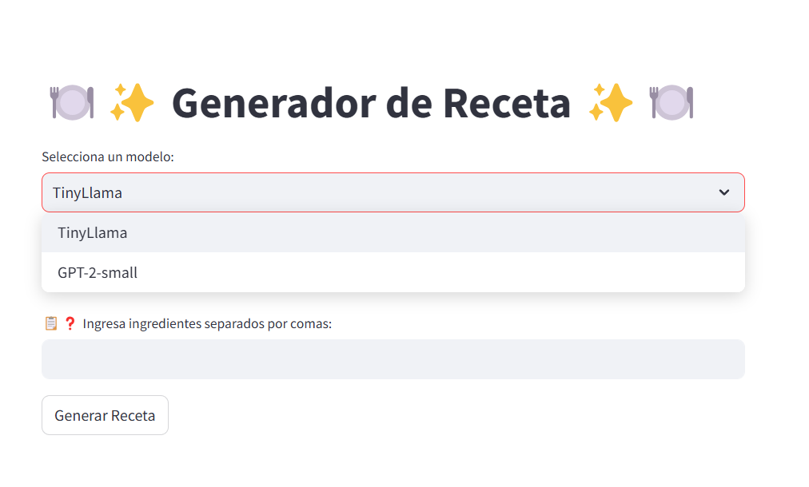
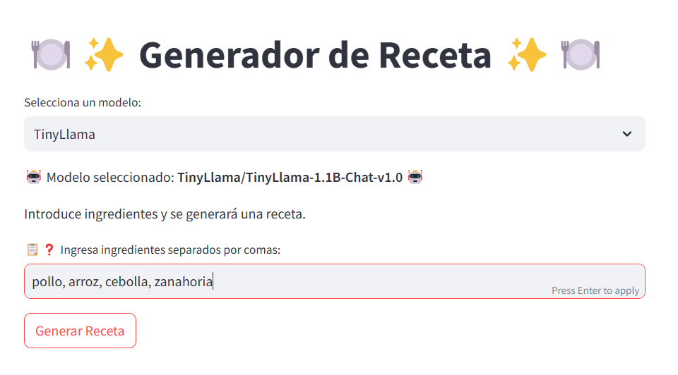
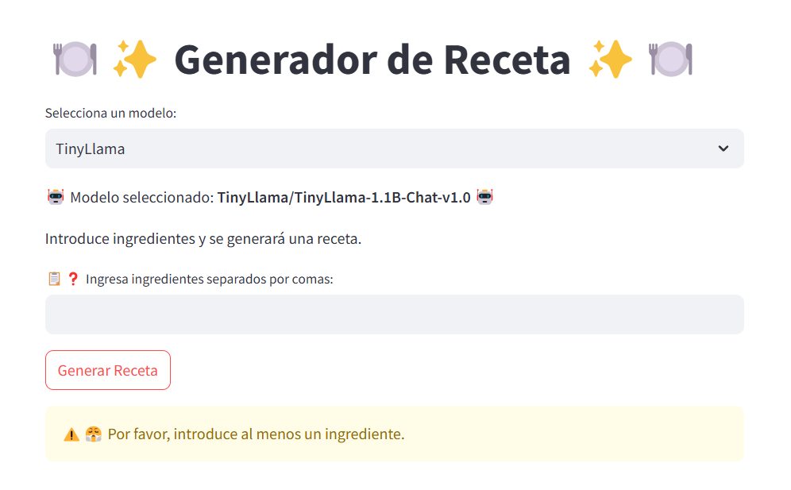
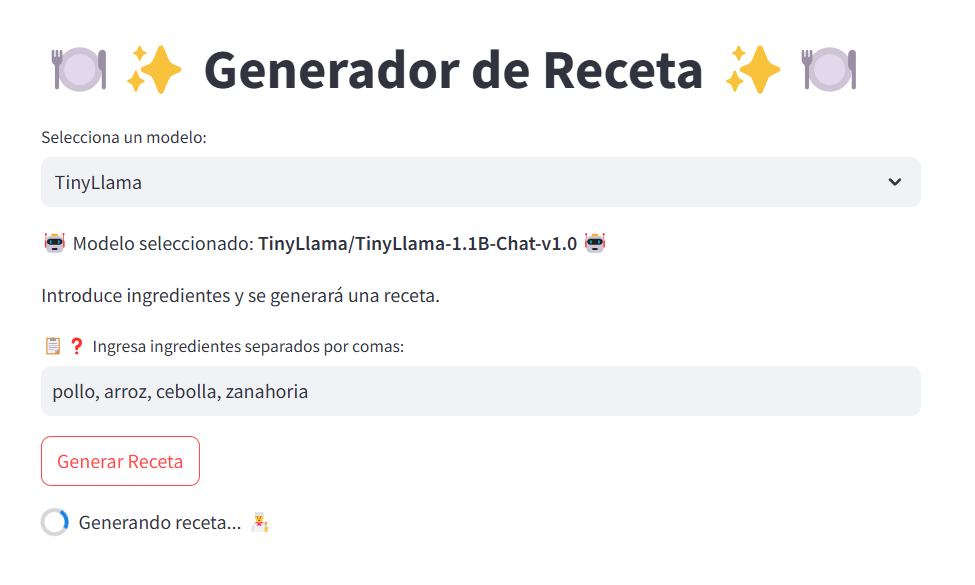
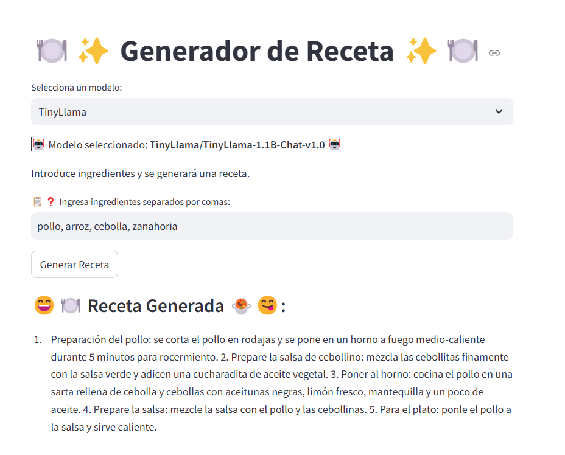

# Herramienta para la generación de recetas de cocina.

En este repositorio se presenta el desarrollo y creación de una herramienta basada en generación de texto, específicamente recetas de cocina, se establece el uso de los siguientes dos modelos de lenguaje, los cuales fueron seleccionados considerando su eficacia, su capacidad para generar texto en idioma español y los recursos computacionales disponibles:

1. GPT2-Small-Spanis: es un modelo de lenguaje basado en GPT-2 Small, optimizado para la generación de texto en español. Fue desarrollado por Datificate y afinado con datos de Wikipedia en español, utilizando técnicas avanzadas de aprendizaje profundo con las bibliotecas de Hugging Face y fastai v2. Su principal aplicación es la generación automática de recetas de cocina a partir de ingredientes proporcionados por el usuario. Requiere Python 3.8+, PyTorch o TensorFlow, y puede ejecutarse en GPU para mayor eficiencia. El modelo tiene licencia Apache 2.0, con restricciones sobre su uso y distribución.

2. TinyLlama - 1.1B: es un modelo de generación de texto basado en la arquitectura LLaMA 2, diseñado para ser compacto y eficiente en hardware limitado. Con 1.1B de parámetros, fue optimizado mediante técnicas como reducción de capas y atención de consultas agrupadas, logrando un tamaño de 600MB en disco. Su entrenamiento incluyó 3 trillones de tokens y se realizó con 16 GPUs, usando datasets como Slim Pijama y Starcoderdata. Su principal aplicación es la generación de recetas de cocina a partir de ingredientes proporcionados por el usuario. Cuenta con licencia Apache 2.0, con restricciones sobre su uso y distribución.

El repositorio incluye diversos scripts para cada una de las funciones de la herramienta. También se detallan los requisitos necesarios para su funcionamiento óptimo, las instrucciones de instalación, las pruebas unitarias realizadas para garantizar su correcto desempeño y la licencia correspondiente.

# Tabla de contenido
- [Introducción](#introducción)
    - [Generación automática de recetas con modelos de lenguaje](#generacion-automatica-recetas)
- [Estructura del repositorio](#Estructura-del-repositorio)
- [Archivos del repositorio](#archivos-del-repositorio)
    - [app.py](#app-py)
    - [config.py](#config-py) 
    - [model.py](#model-py)  
    - [ui.py](#iu-py)     
 - [Requerimientos para usar la herramienta de detección](#requerimientos-para-usar-la-herramienta-de-detección)
 - [Dockerización](#Dockerización)
 - [Integrantes del proyecto](#Integrantes-del-proyecto)

---

# Introducción

 ## Generación automática de recetas con modelos de lenguaje
La generación automática de recetas de cocina es un campo en crecimiento dentro de la inteligencia artificial, permitiendo a los usuarios obtener recetas personalizadas a partir de los ingredientes disponibles. Mediante el uso de modelos de lenguaje avanzados, se pueden crear platos diversos, optimizando el tiempo en la cocina y reduciendo el desperdicio de alimentos.

Los modelos GPT2-Small-Spanish y TinyLlama-1.1B han sido seleccionados por su capacidad de generar texto en español y su eficiencia en términos computacionales. GPT2-Small-Spanish es un modelo ligero y optimizado para el idioma español, mientras que TinyLlama-1.1B, basado en LLaMA 2, es un modelo compacto y eficiente diseñado para hardware con recursos limitados.

Estos modelos han sido entrenados con grandes volúmenes de datos y técnicas avanzadas de aprendizaje profundo para mejorar su coherencia y precisión en la generación de recetas. Gracias a su integración con la plataforma Hugging Face y el uso de frameworks como PyTorch, su implementación en entornos de producción y de investigación resulta accesible y versátil.

El desarrollo de esta herramienta no solo facilita la exploración culinaria, sino que también abre nuevas posibilidades para la personalización de recetas, la innovación gastronómica y la investigación en generación de texto aplicada a la cocina.

# Estructura del repositorio

A nivel general, la estructura del proyecto es la siguiente:

1. Directorios principales:

- Images/ Contiene las imágenes utilizadas en el proyecto.
- Src (Source)/ Contiene el código fuente del proyecto, organizado en los siguientes subdirectorios:
  - Models/ almacena el modelo entrenado y el script necesario para su gestión y uso.
  - Visualizations/ Contiene scripts para la generación de la interfaz de usuario. 
- Test/ Almacena las pruebas unitarias del proyecto.

2. Archivos en la raíz del proyecto:
- gitignore: Define los archivos y carpetas que deben ser ignorados en el control de versiones con Git.
- Dockerfile: Especifica las instrucciones para construir el contenedor Docker del proyecto.
- main.py: Archivo principal que sirve como punto de entrada al programa.
- README.md: Documento con información detallada sobre el uso y configuración del proyecto.
- requirements.txt: Lista de dependencias de Python necesarias para la ejecución del proyecto.
- LICENSE.txt: Contiene la licencia del proyecto, especificando los términos de uso y distribución del código.
   
# Archivos del repositorio

## app.py

Este script define la interfaz de usuario utilizando Streamlit. Permite al usuario ingresar ingredientes y generar recetas basadas en modelos de lenguaje preentrenados. 

A través de la interfaz, se pueden seleccionar diferentes modelos de generación de texto y enviar solicitudes para obtener recetas personalizadas. Se implementan validaciones y manejo de errores para mejorar la experiencia del usuario.

## config.py

Este script almacena la configuración global del proyecto, incluyendo las opciones de modelos de lenguaje y sus respectivas rutas. Además, define parámetros clave para la generación de recetas, como la temperatura, la penalización por repetición y la estrategia de muestreo. 

Centralizar la configuración en este archivo facilita la modificación y mantenimiento del sistema sin afectar otros módulos.

## model.py

Este script maneja la carga del modelo de lenguaje utilizado para generar recetas. Se encarga de inicializar el modelo y su tokenizador, así como de transferirlos al dispositivo adecuado para su ejecución.

Al separar esta funcionalidad, se garantiza un mejor desacoplamiento del sistema, permitiendo reutilizar el modelo en diferentes partes de la aplicación.

## ui.py

Este script define la lógica de la interfaz de usuario en Streamlit. Proporciona los elementos gráficos para la interacción, como cuadros de entrada, botones y mensajes de respuesta. 

Además, gestiona la comunicación con el modelo de generación de recetas y maneja posibles errores o advertencias para mejorar la experiencia del usuario.

# Requerimientos para usar la Herramienta para la generación de recetas de cocina

Para ejecutar correctamente Herramienta para la generación de recetas de cocina, siga los siguientes pasos:

1. Se debe clonar la información del repositorio uao-neumonia  el cual se encuentra en el siguiente enlace  https://github.com/UAOFranciscoRivera901/uao-recetas.git
2. Asegúrate de tener Python instalado en tu ordenador. Se recomienda usar la versión Python 3.12.2
3. crear y configurar un entorno virtual: Puede craer su entorno virtual desde la consola del sistema o puede usar VS Code. Nota: Un entorno virtual es un espacio aislado dentro de tu sistema donde puedes instalar bibliotecas y dependencias necesarias para un proyecto, sin afectar el resto del sistema ni otras aplicaciones.
- Si desea usar VS Code estas son las instrucciones a seguir:
- Inicia Visual Studio Code desde el directorio donde has clonado el repositorio del proyecto.
- Puedes abrir la barra de comandos presionando ctrl + Shift + P.
- Escribe y busca la opción "Python: Crear un entorno virtual" para crear el entorno virtual.
- Selecciona la opción "Crear entorno virtual (.venv)
- Asegúrate de elegir la versión Python  3.12.2
- No olvides seleccionar el archivo requirements.txt. Este archivo contiene todas las bibliotecas y dependencias necesarias para el funcionamiento correcto del proyecto.

# Uso de la interfaz gráfica

## Paso 1: Ejecutar la aplicación
Abrir una terminal o línea de comandos en la carpeta donde se encuentra el archivo app.py.
Escribir el siguiente comando y presionar Enter:
- streamlit run app.py
Esto abrirá automáticamente la interfaz gráfica en el navegador.

Paso 1: Seleccionar el modelo de generación
En la parte superior de la interfaz, habrá un menú desplegable con las opciones de modelos de lenguaje disponibles.
El usuario debe seleccionar el modelo con el que desea generar recetas.

## Paso 2: Ingresar los ingredientes
En la caja de texto, el usuario debe escribir los ingredientes que tiene disponibles, separados por comas.
Ejemplo:
pollo, arroz, cebolla, zanahoria

Si no ingresa ingredientes y presiona el botón, se mostrará un mensaje de advertencia.

## Paso 3: Generar la receta
Presionar el botón "Generar Receta".
La aplicación procesará los ingredientes y enviará la solicitud al modelo seleccionado.

## Paso 4: Visualizar la receta
En la parte inferior de la interfaz, se mostrará la receta generada por el modelo.
La receta incluirá los pasos de preparación basados en los ingredientes ingresados.

## Paso 5: Modificar ingredientes o modelo (opcional)
Si el usuario no está satisfecho con la receta, puede:
Cambiar los ingredientes y presionar nuevamente el botón "Generar Receta".
Seleccionar otro modelo en el menú desplegable y probar con diferentes configuraciones.

## Paso 6: Cerrar la aplicación
Para cerrar la aplicación, simplemente debe cerrar la pestaña del navegador.
En la terminal, presionar Ctrl + C para detener la ejecución de Streamlit.

# Dockerización

La Dockerización es el proceso de empaquetar una aplicación junto con todas sus dependencias, configuraciones y bibliotecas necesarias en un contenedor Docker. Esto permite que la aplicación se ejecute de manera consistente y reproducible en cualquier entorno, sin importar el sistema operativo o la configuración de la máquina en la que se ejecute.

1. Creación del Docker File
   
Docker File es un archivo de texto que contiene una serie de instrucciones para construir una imagen de Docker, este se un archivo de texto que contiene una serie de instrucciones para construir una imagen de Docker, este archivo debe estar dentro de la raíz del proyecto y se configura de la siguiente manera:

- Se usa una imagen base (se especifica la versión de Python) - (FROM python:3.12.2-slim)
- Se instalan dependencias necesarias anexas en el requirements.txt

2. Crear la imagen

La imagen es un archivo plantilla preconfigurado y portable que nos permite garantizar el mismo entorno de ejecucion para la aplicación

Para crear la imagen, sigue estos pasos

- Abre la terminal de tu sistema operativo o en VS CODE
- Navega al directorio del proyecto donde se encuentra el Dockerfile. Puedes usar el comando cd para cambiar de directorio.
- crea la imagen usando el siguiente comando 
    Docker build –t [nombre_imagen] .

4. Iniciar la imagen y crear el contenedor Docker

Para ejecutar la imagen y crear el contenedor Docker se usa el siguiente comando en el cual -p puerto_imagen:puerto_host
Para el ejercicio el puerto de la aplicación es 8501 
- crear el contenedor con el siguiente comando
docker run -d -p 8501:8501 [nombre_imagen]

Bibliografía
https://docs.docker.com/get-started/docker-overview/
https://www.docker.com
https://docs.oracle.com/cd/E37929_01/html/E36693/gmcdr.html

# Integrantes del proyecto

- Francisco Javier Rivera Rozo
- Carlos Armando Daza Rendón
- Andrés Felipe Coral
- Alejandro Sánchez Murillo
